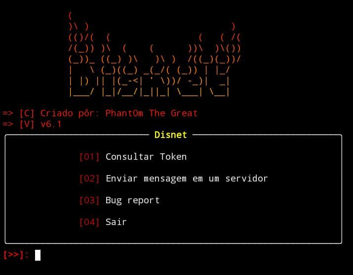

  
  
# Disnet 💉🔥
Disnet, é uma ferramenta que permite extrair informações importantes de uma conta do discord pôr meio do token, isso inclui ↓
- [x] Número de telefone
- [x] Email
- [x] Nome de Usuário
- [x] Nome de exibição
- [x] Ícone de perfil
- [x] ID do usuário
- [x] Se tem Nitro
- [x] Verificação de duas etapas
- [x] Data de criação da conta
- [x] Linguagem
- [x] Se o email é verificado pelo discord
- [x] Cor do banner do perfil em hexadecima
- [x] Flags
- [x] Username dos amigos
- [x] Nome dos servidores que participa
- [x] Quantidade de amigos
- [x] Quantidade de servidores que participara

Também é possível enviar mensagens para servidores 
## 🧪 Testado em...
 > - - [ ] **KALI** 

 > - - [x] **TERMUX**

## 🔧 Instalação no Termux

 - `git clone github.com/Phant0mthegreat/Disnet`

 - `cd Disnet`
   
 - `bash install.sh` ou use `pip install -r requirements.txt`

## 💉 Iniciar
Use o comando ↓
 - `python3 Disnet.py`
para iniciar o programa quando quiser

## 🗃️ Versão Atual: 6.1
1.0 = 17/07/2023

1.5 = 25/07/2023

1.6 = 29/07/2023

2.0 = 31/07/2023

2.5 = 03/09/2023

3.0 = 03/09/2023

3.5 = 04/09/2023

3.6 = 06/09/2023

4.0 = 17/09/2023

5.0 = 19/09/2023

6.0 = 24/09/2023

6.1 = 27/09/2023

## 📜 Nota
Para que a instalação funcione, é preciso ter o "git", a línguagem python e o "pip" instalados.
